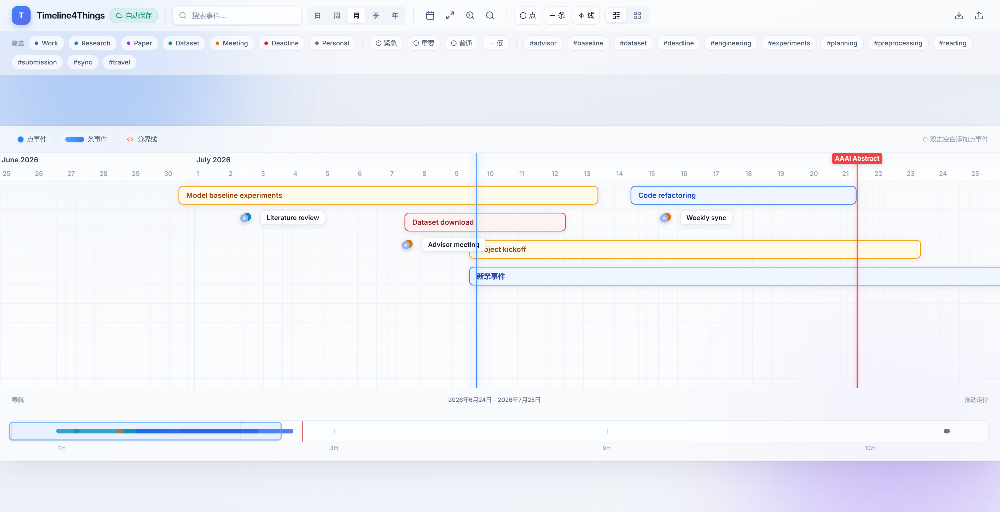
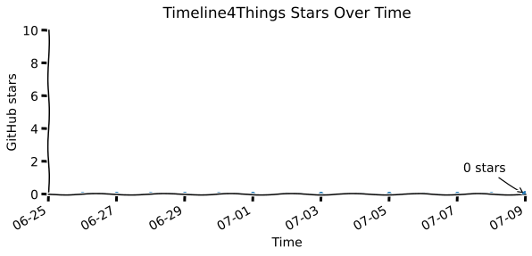

# Timeline4Things

**A lightweight timeline annotation tool for key moments and temporal events**

[](https://fasuiker.github.io/Timeline4Things/)
[](https://github.com/Fasuiker/Timeline4Things/stargazers)
[](LICENSE)
[](https://react.dev/)
[](https://www.typescriptlang.org/)
[](https://vite.dev/)

Timeline4Things is a browser-based timeline workspace for marking what happened, what is in progress, and what comes next. Pin **point events** on a single day, stretch **range events** across weeks or months, and drop **dividers** to label phases — then zoom from day-level detail out to a multi-year view.

**[Try the live demo →](https://fasuiker.github.io/Timeline4Things/)** · No install, no account. Data stays in your browser.

<p align="center">
  <a href="https://fasuiker.github.io/Timeline4Things/">
    
  </a>
</p>

<p align="center">
  <strong>⭐ Enjoying Timeline4Things? <a href="https://github.com/Fasuiker/Timeline4Things/stargazers">Star the repo</a> — it helps others discover this tool.</strong>
</p>

---

## Why Timeline4Things?

| Use case | What you can do |
|----------|-----------------|
| **Research & writing** | Track literature reviews, experiments, drafts, and submission deadlines |
| **Personal projects** | Log milestones, sprints, and retrospectives on one canvas |
| **Life planning** | Annotate trips, health routines, or any sequence of key moments |
| **Lightweight PM** | Replace a heavy Gantt chart when you only need *when*, not *who does what* |

Built for people who want a **clean, interactive timeline** — not a landing page, not a full project-management suite.

---

## Features

### Timeline canvas
- **Five time scales**: Day · Week · Month · Quarter · Year
- **Pan & zoom**: mouse wheel to scroll, `Ctrl` + wheel to zoom, drag events to reschedule
- **Today** and **Fit all** shortcuts to jump in time
- **Bottom navigator** with month/year ticks and a live viewport indicator

### Events & annotations
- **Point events** — single-day markers (meetings, deadlines, milestones)
- **Range events** — bars with draggable start/end (projects, experiments, writing phases)
- **Dividers** — vertical phase lines with visible labels (e.g. “Phase II”, “Submission window”)
- **Importance levels**: low · medium · high · critical (color-coded)
- **Categories & tags** with search and multi-filter

### Views & editing
- **Compact mode** — all events on one track
- **Lane mode** — one row per category (Work, Research, Paper, …)
- **Floating edit panels** for events and dividers (no cramped sidebar)
- **Double-click** empty space to create a new point event

### Data ownership
- **Auto-save** to `localStorage`
- **JSON import / export** — portable, versioned format
- Sample data on first launch so you can explore immediately

### Keyboard shortcuts

| Key | Action |
|-----|--------|
| `N` | New event |
| `Esc` | Close panel |
| `Delete` / `Backspace` | Delete selected event (with confirm) |
| `+` / `-` | Zoom in / out |
| `Ctrl` / `Cmd` + `S` | Save current panel |

---

## Quick start

### Try online (recommended)

Open **[fasuiker.github.io/Timeline4Things](https://fasuiker.github.io/Timeline4Things/)** in your browser — no setup required.

### Run locally

**Requirements:** Node.js 18+ (Node 20 recommended — see `.nvmrc`)

```bash
git clone https://github.com/Fasuiker/Timeline4Things.git
cd Timeline4Things
npm install
npm run dev
```

Open the URL shown in the terminal (usually `http://localhost:5173`).

### Production build

```bash
npm run build
npm run preview
```

Static files are emitted to `dist/`. For GitHub Pages:

```bash
npm run build:pages
```

Pushes to `main` auto-deploy via [GitHub Actions](.github/workflows/deploy-pages.yml) (enable **Settings → Pages → Build and deployment → GitHub Actions**).

---

## Usage guide

1. **Browse** — use the scale pills (日/周/月/季/年) or scroll the timeline horizontally.
2. **Create** — click **Add** in the toolbar, double-click the canvas, or press `N`.
3. **Edit** — click an event or divider; a floating panel opens.
4. **Move** — drag events; drag range ends to resize; drag dividers along the axis.
5. **Filter** — use the filter bar for categories, importance, and tags.
6. **Navigate** — drag the blue window in the bottom **导航** strip to jump across months or years.
7. **Backup** — **Export** JSON from the toolbar; **Import** to restore or merge on another machine.

---

## Data format

Exported JSON includes events, categories, and dividers:

```json
{
  "version": 1,
  "events": [
    {
      "id": "evt_001",
      "type": "point",
      "title": "Project kickoff",
      "date": "2026-07-09",
      "importance": "high",
      "category": "Work",
      "tags": ["planning"],
      "description": "Initial kickoff with the team."
    },
    {
      "id": "evt_002",
      "type": "range",
      "title": "Baseline experiments",
      "startDate": "2026-07-01",
      "endDate": "2026-07-20",
      "importance": "medium",
      "category": "Research",
      "tags": ["experiments"]
    }
  ],
  "categories": [
    { "id": "work", "name": "Work", "color": "#2563eb" }
  ],
  "dividers": [
    { "id": "div_001", "title": "Phase II", "date": "2026-08-01", "color": "#ef4444" }
  ]
}
```

Storage key in the browser: `timeline-studio-data`.

---

## Tech stack

| Layer | Choice |
|-------|--------|
| UI | React 19 + TypeScript |
| Build | Vite 6 |
| Styling | Tailwind CSS v4 |
| State | Zustand |
| Timeline engine | [vis-timeline](https://visjs.github.io/vis-timeline/) |
| Dates | date-fns |
| Components | Radix UI primitives · lucide-react icons |

---

## Project structure

```text
src/
  app/App.tsx              # Shell layout
  components/
    TimelineCanvas.tsx     # vis-timeline integration
    TimelineToolbar.tsx    # Search, scale, zoom, import/export
    FilterBar.tsx
    MiniOverview.tsx       # Bottom navigator
    EventDetailsPanel.tsx
    DividerDetailsPanel.tsx
  store/timelineStore.ts   # State + auto-save
  types/timeline.ts
  utils/                   # dates, storage, event styling
  data/                    # Sample events & dividers
```

---

## Roadmap

- [ ] Dark mode
- [ ] Markdown preview for descriptions
- [x] Online demo (GitHub Pages)
- [ ] Optional cloud sync
- [ ] Attachments / images on events

Ideas and PRs are welcome — see [Contributing](#contributing).

---

## Contributing

1. Fork the repository
2. Create a branch: `git checkout -b feature/your-feature`
3. Commit with a clear message
4. Open a Pull Request

Please keep changes focused and match the existing code style. Run `npm run build` before submitting.

To refresh the README screenshot after UI changes (requires Playwright + Chromium):

```bash
npm run screenshot
```

---

## License

This project is licensed under the [MIT License](LICENSE).

---

## 简体中文

**Timeline4Things** 是一款轻量级时间线标注工具，用来记录和浏览人生、科研或项目中的关键节点与时间跨度事件。

- 在线体验：**[fasuiker.github.io/Timeline4Things](https://fasuiker.github.io/Timeline4Things/)**
- 支持 **点事件**、**区间事件**、**分界线** 三种标注
- 日 / 周 / 月 / 季 / 年 多尺度缩放，底部导航条快速定位
- 数据保存在浏览器本地，可 JSON 导入导出
- MIT 开源，欢迎 Star 支持项目发展

```bash
git clone https://github.com/Fasuiker/Timeline4Things.git
cd Timeline4Things && npm install && npm run dev
```

---

## Star History



---

## Star & share

If Timeline4Things saves you time, **[give it a star on GitHub](https://github.com/Fasuiker/Timeline4Things)** — it is the simplest way to support the project and help more people find a lightweight timeline tool.

---

<p align="center">
  <sub>Timeline4Things — annotate time, stay oriented.</sub>
</p>
